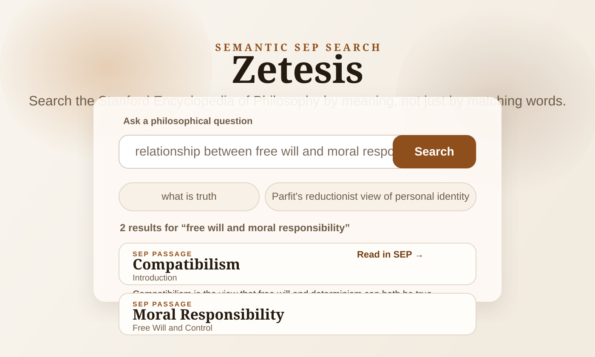

# Zetesis

Semantic search over the Stanford Encyclopedia of Philosophy.

Zetesis lets you type a philosophical question or concept and retrieve the most relevant SEP passages by meaning, not just keyword overlap. Each result links back to the exact SEP section it came from.

It also includes a concept-graph view centered on SEP entries. The graph starts from a searched entry and shows its one-hop neighborhood through:

- explicit edges: direct SEP cross-links from one entry to another
- semantic edges: high-similarity entry pairs derived from averaged chunk embeddings



## What It Does

- Scrapes SEP entries into section-level records
- Splits long sections into retrieval chunks
- Builds entry-level search documents from SEP page structure
- Embeds chunks with `all-mpnet-base-v2`
- Embeds entry-level search documents with `all-mpnet-base-v2`
- Stores embeddings in Postgres with `pgvector`
- Retrieves both chunk-level and entry-level candidates with cosine similarity
- Reranks candidates with a cross-encoder plus lightweight title-aware scoring
- Builds a concept graph with explicit SEP links plus strict semantic neighbors
- Serves results through FastAPI
- Displays them in a small React frontend

## How Retrieval Works

The retrieval pipeline is intentionally simple and interview-friendly:

1. SEP is scraped into sections, each with an entry title, section title, section text, and direct SEP URL.
2. Sections shorter than 400 words stay intact.
3. Longer sections are split by paragraph boundaries into chunks that are roughly 300 to 400 words.
4. The last sentence of one chunk is repeated at the start of the next chunk so context is not lost at chunk boundaries.
5. Each SEP entry also gets an entry-level search document built from its title, section headings, and a short introductory overview.
6. Both chunks and entry documents are embedded with `sentence-transformers/all-mpnet-base-v2`.
7. At query time, the user query is embedded with the same model.
8. Postgres + `pgvector` retrieves global chunk candidates and entry candidates separately.
9. Entry candidates are reranked using entry metadata, then the strongest entries contribute additional chunk candidates from inside those pages.
10. Chunk candidates are reranked using `entry_title + section_title + chunk_text`, not passage text alone.
11. A small title-aware lexical bonus helps canonical SEP pages like `Truth` or `Personal Identity` stay competitive for obvious title-shaped queries.
12. The API returns the top 7 full passages.

The design anticipates a future RAG layer, but the current system is retrieval-only.

## How The Concept Graph Works

The graph is intentionally local rather than global-first:

1. Each SEP entry gets a graph embedding computed as the mean of all its chunk embeddings.
2. Explicit edges come from SEP's own internal links between `/entries/...` pages.
3. Semantic edges come from cosine similarity between entry embeddings.
4. Semantic edges are deliberately strict: an edge is kept only when similarity is above `0.85` and the two entries are in each other's top 5 semantic neighbors.
5. The frontend does not open to a giant full-corpus graph. Instead, search results open a dedicated graph page for a specific SEP entry's one-hop neighborhood.

## Stack

- Scraping: `requests`, `BeautifulSoup`
- Embeddings: `sentence-transformers/all-mpnet-base-v2`
- Reranking: `cross-encoder/ms-marco-MiniLM-L-6-v2`
- Vector storage: Postgres + `pgvector`
- Backend: FastAPI
- Frontend: React + Vite
- Frontend hosting: Vercel
- Local DB/dev container: Docker Compose
- Backend hosting: Render
- Database hosting: Supabase

## Repository Layout

```text
.
├── app.py                         FastAPI entrypoint
├── search.py                      Reusable retrieval + reranking service
├── graph.py                       Reusable graph retrieval service
├── eval.py                        Manual evaluation script
├── docker-compose.yml             Local Postgres/pgvector + API container
├── render.yaml                    Render Blueprint for the backend
├── db/init/01-schema.sql          Database schema
├── scripts/
│   ├── scrape_sep.py              SEP scraper
│   ├── chunk_sep.py               Section chunker
│   ├── build_sep_entries.py       Entry-level document builder
│   ├── embed_sep_chunks.py        Embedding generator
│   ├── embed_sep_entries.py       Entry embedding generator
│   ├── build_graph.py             Graph builder for explicit + semantic edges
│   ├── load_chunks_to_db.py       Chunk loader for Postgres
│   ├── load_entries_to_db.py      Entry loader for Postgres
│   └── tag_subdisciplines.py      Subdiscipline tagging pass for graph coloring
├── frontend/                      React app
│   └── vercel.json                SPA rewrite config for Vercel
├── sep_sections.json              Scraped sections
├── sep_chunks.json                Retrieval chunks
├── sep_entries.json               Entry-level search documents
├── sep_embeddings.npy             Chunk embedding matrix
└── sep_entry_embeddings.npy       Entry embedding matrix
```

## Prerequisites

- Python 3.11+
- Node 20+
- Docker Desktop or another Docker runtime with Compose support

This repo currently includes the generated SEP artifacts, so you can run the app without regenerating the corpus.

Before starting the local database, verify that Compose is available:

```bash
docker compose version
```

If that command fails on macOS, install and launch Docker Desktop first. Docker's official docs note that Docker Desktop is the recommended way to get Compose on Mac, while the standalone Compose plugin install path is Linux-only.

## Environment Variables

Create a backend `.env` from [.env.example](./.env.example):

```bash
cp .env.example .env
```

Create a frontend `.env` from [frontend/.env.example](./frontend/.env.example):

```bash
cp frontend/.env.example frontend/.env
```

Important variables:

- `DATABASE_URL`: backend database connection string
- `CORS_ALLOW_ORIGINS`: comma-separated frontend origins
- `VITE_API_BASE_URL`: frontend URL for the FastAPI backend

## Production Deployment

The deployment path this repo is now prepared for is:

- frontend on Vercel
- backend on Render
- database on Supabase

Recommended production URLs:

- `https://zetesis.example.com` for the frontend
- `https://api.zetesis.example.com` for the backend

### 1. Prepare Supabase

Create a Supabase project and enable the `vector` extension. Then get a Postgres connection string from the Supabase Connect panel.

For the Render backend, prefer a Supabase Session pooler connection string, or a Direct connection string if your environment supports it well. For one-time load scripts from your own machine, either a Direct connection or Session pooler connection is fine.

Load the existing corpus into Supabase:

```bash
cp .env.example .env
```

Set `DATABASE_URL` in `.env` to your Supabase Postgres connection string, then run:

```bash
.venv/bin/python scripts/load_chunks_to_db.py --truncate --drop-index-first
.venv/bin/python scripts/load_entries_to_db.py --truncate --drop-index-first
.venv/bin/python scripts/build_graph.py --semantic-threshold 0.85 --max-semantic-neighbors 5
.venv/bin/python scripts/tag_subdisciplines.py
```

### 2. Deploy the backend to Render

This repo now includes [render.yaml](./render.yaml), which defines a Docker-based Render web service and configures the `/health` endpoint as the Render health check.

In Render:

1. Create a new Blueprint or Web Service from this repository.
2. Use the included `render.yaml` or select [Dockerfile.backend](./Dockerfile.backend) manually.
3. Set these environment variables:

- `DATABASE_URL=<your Supabase connection string>`
- `CORS_ALLOW_ORIGINS=https://zetesis.example.com`

The backend is now `PORT`-aware, so it will bind correctly on Render without any manual command override.

Note: the first deploy can take longer than a typical FastAPI app because the embedding and reranking models may download when the service boots for the first time.

### 3. Deploy the frontend to Vercel

Create a new Vercel project from this same repository and set:

- Root Directory: `frontend`
- Framework Preset: `Vite`
- Build Command: `npm run build`
- Output Directory: `dist`

Set this environment variable in Vercel:

- `VITE_API_BASE_URL=https://api.zetesis.example.com`

The repo now includes [frontend/vercel.json](./frontend/vercel.json), which rewrites all SPA routes back to `index.html` so direct visits to URLs like `/graph/truth` work correctly on Vercel.

### 4. Attach your domains

The simplest production setup is:

- attach `zetesis.example.com` to the Vercel frontend project
- attach `api.zetesis.example.com` to the Render backend service

Then add whatever DNS records Vercel and Render ask for in your DNS provider.

### 5. Final production check

After both deployments are live:

1. Open `https://zetesis.example.com`
2. Run a search
3. Open a graph neighborhood
4. Refresh a direct graph route such as `https://zetesis.example.com/graph/truth`
5. Confirm the backend health endpoint responds at `https://api.zetesis.example.com/health`

## Install Dependencies

Backend:

```bash
python3 -m venv .venv
.venv/bin/pip install -r requirements.txt
```

Frontend:

```bash
cd frontend
npm install
cd ..
```

## How To Run It

### Option A: Local Development

This is the easiest way to run the full app while keeping the frontend and backend easy to iterate on.

### 1. Start Postgres + pgvector

```bash
docker compose up -d db
```

If you see an error like `unknown command: docker compose` or `unknown shorthand flag: 'd' in -d`, your machine has the Docker CLI but not Compose support yet. Install Docker Desktop, open it once so the engine starts, then rerun the command above.

### 2. Load the retrieval corpus into the database

If this is your first run, load the chunk index, the entry index, and then build the graph tables:

```bash
.venv/bin/python scripts/load_chunks_to_db.py --truncate --drop-index-first
.venv/bin/python scripts/load_entries_to_db.py --truncate --drop-index-first
.venv/bin/python scripts/build_graph.py --semantic-threshold 0.85 --max-semantic-neighbors 5
```

These scripts:

- ensures the `vector` extension exists
- create the `chunks` and `entries` tables if needed
- load the chunk metadata + embeddings
- load the entry-level search documents + embeddings
- recreate the HNSW cosine indexes
- populate the explicit + semantic concept-graph edge tables

### 3. Start the FastAPI backend

```bash
.venv/bin/uvicorn app:app --reload
```

Backend URL:

```text
http://127.0.0.1:8000
```

### 4. Start the React frontend

In a second terminal:

```bash
cd frontend
npm run dev
```

Frontend URL:

```text
http://127.0.0.1:5173
```

### 5. Use the app

- Open `http://127.0.0.1:5173`
- Enter a query such as `relationship between free will and moral responsibility`
- Click a result's `Read in SEP →` link to jump to the original SEP entry

## Backend API

### Search endpoint

```http
GET /search?q=free%20will
```

Example:

```bash
curl "http://127.0.0.1:8000/search?q=free%20will"
```

Validation rules:

- empty queries are rejected
- query length is capped at 300 characters

### Graph endpoints

```http
GET /graph/neighborhood?slug=truth&hops=1
```

`/graph/neighborhood` returns one SEP entry plus its local explicit and semantic neighbors.

## Rebuild The Corpus From Scratch

These steps are one-time data prep, not part of the running app.

### 1. Scrape SEP

```bash
python3 scripts/scrape_sep.py --output sep_sections.json
```

This uses a 1-second delay between requests and writes section records to `sep_sections.json`.

### 2. Chunk the sections

```bash
python3 scripts/chunk_sep.py --input sep_sections.json --output sep_chunks.json
```

### 3. Generate embeddings

```bash
.venv/bin/python scripts/embed_sep_chunks.py --input sep_chunks.json --output sep_embeddings.npy
```

Notes:

- batch size is `64`
- the embedding model outputs `768`-dimensional vectors
- embedding generation is the slowest step

### 4. Build entry-level search documents

```bash
.venv/bin/python scripts/build_sep_entries.py --input sep_sections.json --output sep_entries.json
```

This creates one search document per SEP entry from:

- the entry title
- the section heading outline
- a short intro-sized overview excerpt

### 5. Generate entry embeddings

```bash
.venv/bin/python scripts/embed_sep_entries.py --input sep_entries.json --output sep_entry_embeddings.npy
```

### 6. Load the database

```bash
.venv/bin/python scripts/load_chunks_to_db.py --truncate --drop-index-first
.venv/bin/python scripts/load_entries_to_db.py --truncate --drop-index-first
.venv/bin/python scripts/build_graph.py --semantic-threshold 0.85 --max-semantic-neighbors 5
```

### 7. Tag subdisciplines for graph coloring

```bash
.venv/bin/python scripts/tag_subdisciplines.py
```

## Run The Retrieval Eval

`eval.py` runs 25 hand-picked philosophical queries and prints the top 3 results for manual review.

```bash
.venv/bin/python eval.py
```

Useful flags:

```bash
.venv/bin/python eval.py --result-limit 3 --candidate-limit 20 --snippet-length 220
```

## Notes On The Database Schema

The embedding column is defined as:

```sql
embedding vector(768)
```

That `768` matches `all-mpnet-base-v2`. If the embedding model changes later, the schema must change too.

## Current Status

Implemented:

- SEP scraping
- chunking
- embedding generation
- pgvector schema + loader
- retrieval and reranking
- concept graph route
- FastAPI backend
- React frontend
- manual retrieval evaluation script

Not yet implemented:

- LLM answer synthesis / RAG response generation

## Suggested First Run

If you just want to see the project working locally:

```bash
python3 -m venv .venv
.venv/bin/pip install -r requirements.txt
cp .env.example .env
cp frontend/.env.example frontend/.env
docker compose up -d db
.venv/bin/python scripts/load_chunks_to_db.py --truncate --drop-index-first
.venv/bin/python scripts/load_entries_to_db.py --truncate --drop-index-first
.venv/bin/python scripts/build_graph.py --semantic-threshold 0.85 --max-semantic-neighbors 5
.venv/bin/uvicorn app:app --reload
```

Then in another terminal:

```bash
cd frontend
npm install
npm run dev
```

Open:

```text
http://127.0.0.1:5173
```
